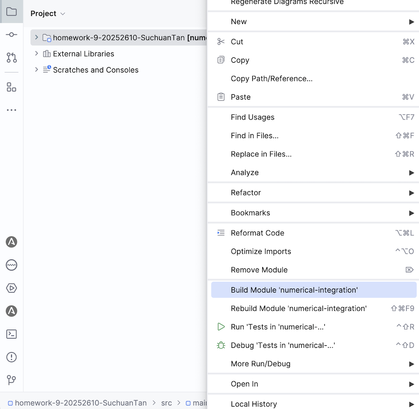
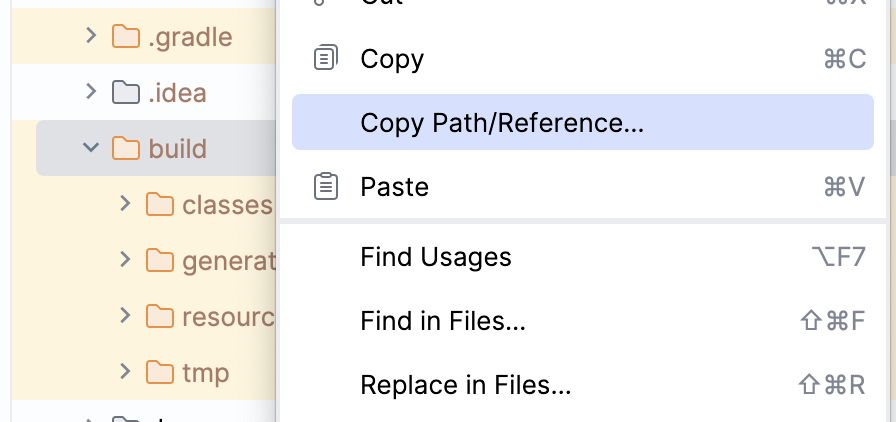
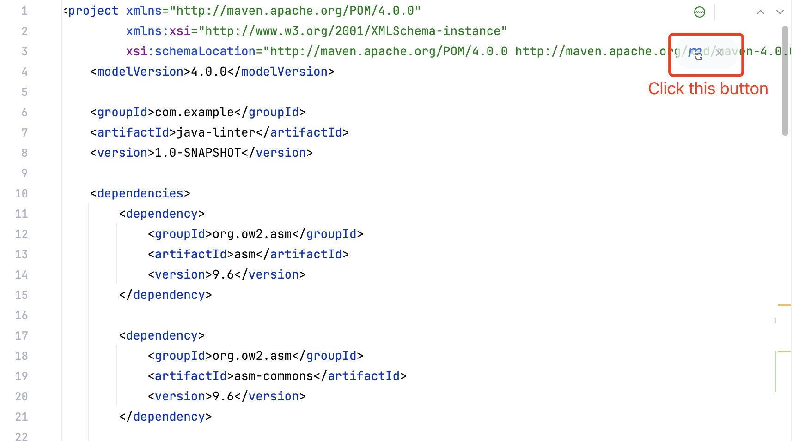
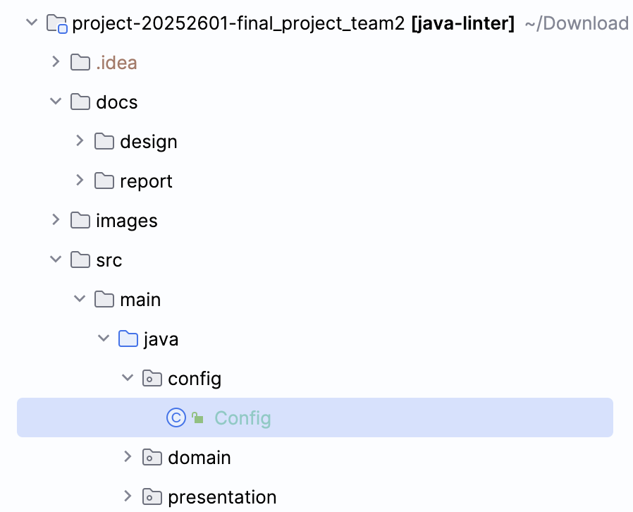
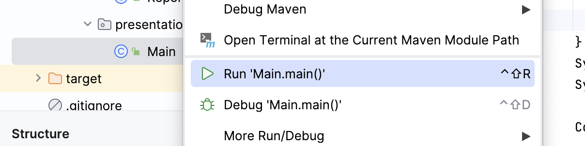
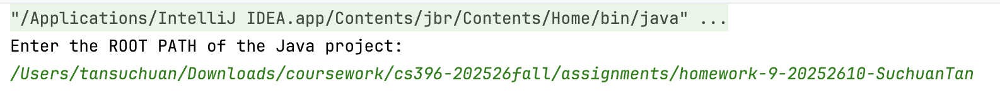
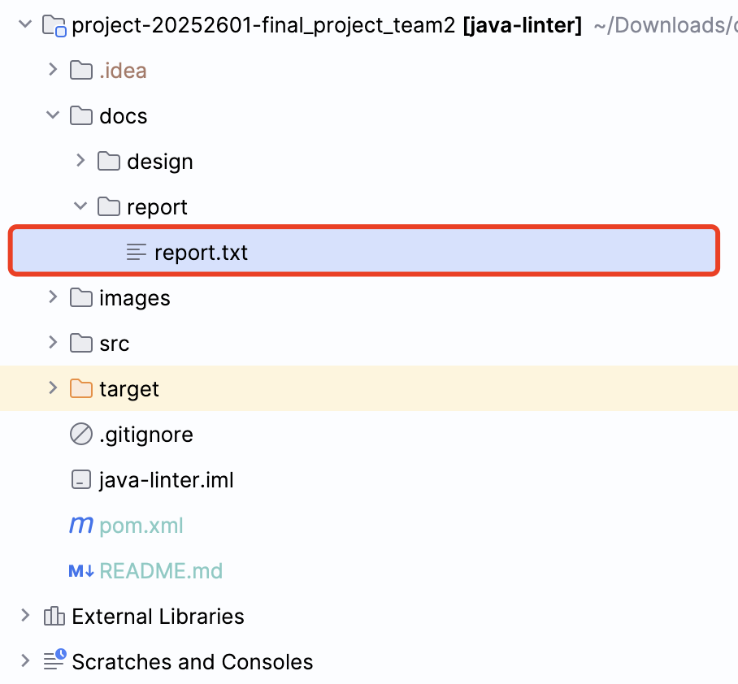

# Project: Java Linter

## Contributors
Suchuan Tan, Jinxi Zhang

## Dependencies
| Dependency  | Version |
|-------------|---------|
| Java        | 11      |
| asm         | 9.6     |
| lombok      | 1.18.32 |
| openai-java | 4.0.0   |

## Build Instructions
1. Open the Java project to be analyzed in IntelliJ IDEA and build the project to generate compiled `.class` files.

2. Copy the path to the directory containing the compiled `.class` files of the target project.

3. Clone this repository from GitHub and open it in IntelliJ IDEA.

4. Use Maven to download and install all project dependencies defined in `pom.xml`.

5. Open `config.Config` and configure:
    - the output path for the analysis report
    - the ChatGPT API key (Optional)  
      If no API key is provided, the LLM feedback feature will be disabled.

6. Run `presentation.Main`. When prompted in the console, paste the previously copied path to the target project’s `.class` files.

7. View the analysis result in the console or in the generated `report.txt` file.

