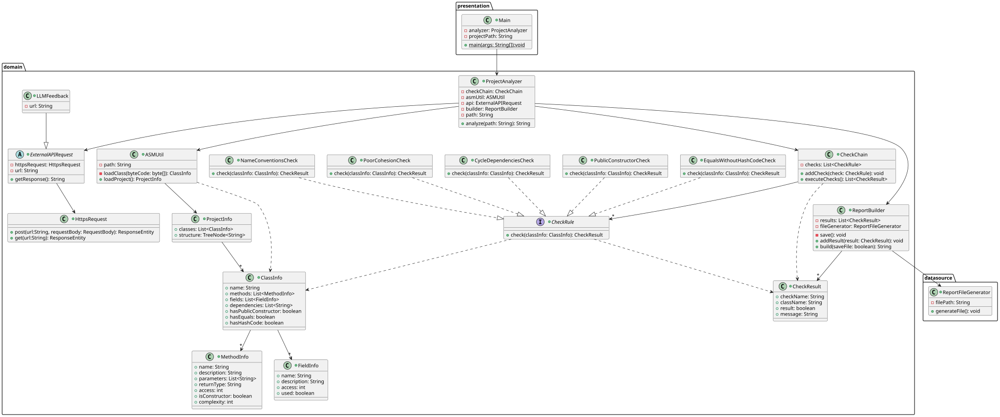
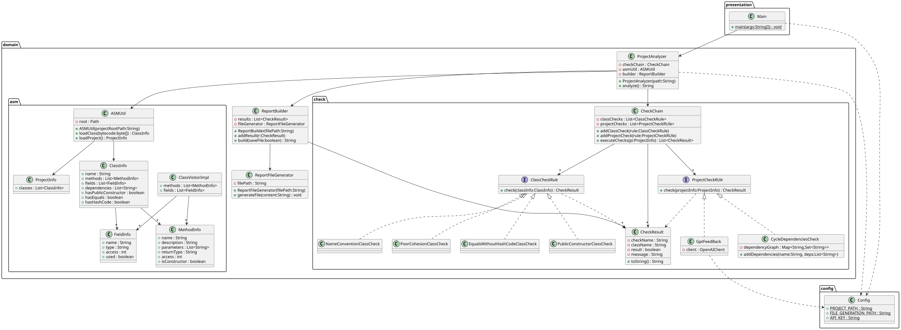

# Requirement
## We want to perform the following inspections on the bytecode of a Java project:
1. Violation of naming conventions
2. Classes that define one of the equals() and hashCode() methods, but not both methods
3. Classes that can’t be publicly constructed
4. Tight coupling, like cycle dependency
5. Poor cohesion
6. Connect to a LLM API to give feedback on the design

## The following shows the class diagrams of our initial design and final implementation.
* Initial Design

* Final Implement
  